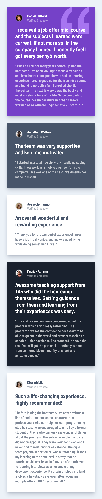
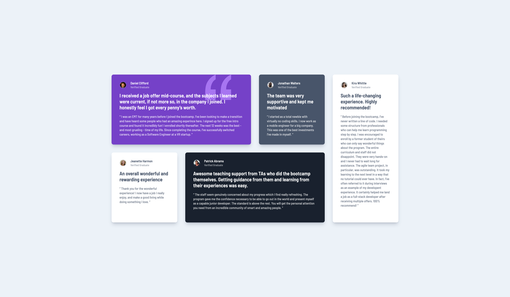

# Testimonials grid section solution

This is a solution to the [Testimonials grid section challenge on Frontend Mentor](https://www.frontendmentor.io/challenges/testimonials-grid-section-Nnw6J7Un7). Frontend Mentor challenges help you improve your coding skills by building realistic projects.

## Table of contents

-   [Overview](#overview)
    -   [The challenge](#the-challenge)
    -   [Screenshot](#screenshot)
    -   [Links](#links)
-   [My process](#my-process)
    -   [Built with](#built-with)
    -   [What I learned](#what-i-learned)

## Overview

### The challenge

Users should be able to:

-   View the optimal layout for the site depending on their device's screen size

### Screenshot

### Links

-   Solution URL: [Github Repo](https://github.com/shobhit-gupta/fem13-testimonials)
-   Live Site URL: [https://fem13-testimonials.vercel.app](https://fem13-testimonials.vercel.app)

## My process

### Built with

-   [Svelte](https://svelte.dev/) - Frontend Framework (like React)
-   [SvelteKit](https://kit.svelte.dev/) - Fullstack Framework (like Next.js)
-   [tailwindcss](https://tailwindcss.com/) - Utility-first CSS framework
-   [TypeScript](https://www.typescriptlang.org) - Strongly Typed language built on Javascript

### What I learned

-   `$$restProps.class` solution to pass classes to child component from parent.
-   Quality Separation of Concerns
-   Leveraging Global Styles to allow parent components to customize child components.
-   Rapid Prototyping
